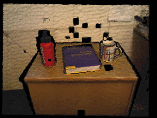

# MID-Fusion

This repository contains MID-Fusion: a new multi-instance dynamic RGBD SLAM system using an object-level octree-based volumetric representation.




It can provide robust camera tracking in dynamic environments and at the same time, continuously estimate geometric, semantic, and motion properties for arbitrary objects in the scene. For each incoming frame, we perform instance segmentation to detect objects and refine mask boundaries using geometric and motion information. Meanwhile, we estimate the pose of each existing moving object using an object-oriented tracking method and robustly track the camera pose against the static scene. Based on the estimated camera pose and object poses, we associate segmented masks with existing models and incrementally fuse corresponding colour, depth, semantic, and foreground object probabilities into each object model. In contrast to existing approaches, our system is the first system to generate an object-level dynamic volumetric map from a single RGB-D camera, which can be used directly for robotic tasks. Our method can run at 2-3 Hz on a CPU, excluding the instance segmentation part. We demonstrate its effectiveness by quantitatively and qualitatively testing it on both synthetic and real-world sequences.


More information can be found on the [paper](https://arxiv.org/pdf/1812.07976.pdf) and [video](https://www.youtube.com/watch?v=gturboNl9gg).

## How to use our software
### Dependencies
The following packages are required to build the `se-denseslam` library:
* CMake 
* Eigen3 
* OpenMP 
* OpenCV

The benchmarking and GUI apps additionally require:
* GLut
* OpenGL
* OpenNI2
* PkgConfig/Qt5

  

### Installation:

Go into the ***apps/kfusion*** folder, simply run the following command to install the software and the dependencies

```
make
```


### Uninstall:

```
make clean
```


### Docker container:
We bundle a [Visual Studio Code development container](https://code.visualstudio.com/docs/remote/containers), the `Dockerfile` of which you can also use stand-alone. Remember to mount the data folder (e.g. change directory location in `volumes` in `.devcontainer/docker-compose.yml` to the container. Use `xhost +` to allow the container to access the host's X server.


### Dependency
If you meet any dependency issue in compiling, please refer to [github action file](https://github.com/smartroboticslab/mid-fusion/blob/master/.github/workflows/main.yml) or [report an issue](https://github.com/smartroboticslab/mid-fusion/issues).


### Demo:

We provide some usage samples. Please see the bash files in the ***apps/kfusion/demo***  folder, which contains some demo scripts, or simply run in the `apps/kfusion` folder

```
make demo_cup_bottle 
```

to test on the sequences of the moving cup and bottles.

Others are:

  * `make demo_carrot`: test on the sequences of the moving carrot
  * `make demo_multi_obj `:  test on the sequences of the multiple objects
  * `make demo_rotate_book`:  test on the sequences of the rotated book
  * `make demo_syn_2objs`: test on the synthetic datasets of two moving objects

The data used to run those bash can be downloaded via [this link](https://drive.google.com/drive/folders/1DmqX59qw_U6YsmkY9aZfZ5y0Dt65N_1x?usp=sharing). Remember to modify the datasets address in the bash files accordingly.

### Customised settings:

  RGB-D sequences need to be given in the SLAMBench 1.0 file format (https://github.com/pamela-project/slambench). Then you can run our modified Mask RCNN script (check [this repo](https://github.com/binbin-xu/maskrcnn_for_midfusion/blob/master/demo/video_mask_rcnn.py)) to generate masks, classes, and semantic probability in cnpy format. You may need to tune some parameters in the [file](https://github.com/smartroboticslab/mid-fusion/blob/master/apps/kfusion/include/default_parameters.h) and parse them as arguments for your own sequences.

  Notice: We used the [tensorpack-version Mask RCNN](https://github.com/tensorpack/tensorpack/tree/master/examples/FasterRCNN) to generate object masks in our original work. However, the Mask RCNN system we used at that time is obsolete and cannot be run any more due to the tensorflow update. Here we provide a [maskrcnn-benchmark](https://github.com/binbin-xu/maskrcnn_for_midfusion) version for usage. We did not finetune either of those versions, but the results would be much improved with a better/more suited segmentation mask. Therefore if you want to increase performance in your specific domain, please **consider training a network on your data**. 


### Difference with supereight implementation:

  This is an official implementation of MID-Fusion system. The system is implemented based on [supereight](https://github.com/emanuelev/supereight), an octree-based volumetric representation. However, MID-Fusion was developed in parallel with supereight system. Therefore you may notice some structure and contents differences between the two systems. We are trying to merge the new updates from supereight into our MID-Fusion implementation. We greatly appreciate the contribution of the supereight team.


## Citations

Please consider citing this project in your publications if it helps your work. The following is a BibTeX reference. The BibTeX entry requires the `url` LaTeX package.

```
@inproceedings{Xu:etal:ICRA2019,
author = {Binbin Xu and Wenbin Li and Dimos Tzoumanikas and Michael Bloesch and Andrew Davison and Stefan Leutenegger},
booktitle = {IEEE International Conference on Robotics and Automation (ICRA)},
+ title = {{MID-Fusion}: Octree-based Object-Level Multi-Instance Dynamic SLAM},
year = {2019},
}
```

## License
Copyright © 2017-2019 Smart Robotics Lab, Imperial College London \
Copyright © 2017-2019 Binbin Xu (b.xu17@imperial.ac.uk)

Distributed under the [BSD 3-clause license](LICENSE). 
